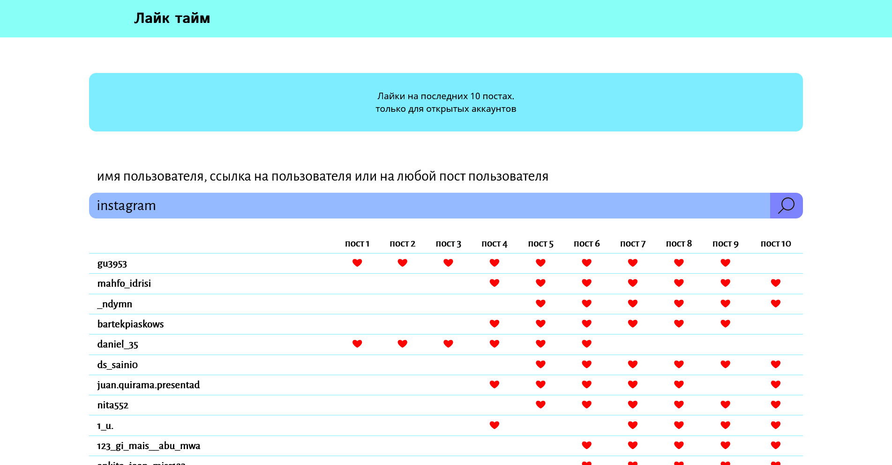

# Like time

The site gives you a table of who liked your posts on instagram


## Installation

* install [python3](https://www.python.org/downloads/)
* install and run [redis](https://redis.io/download)
* install requirements:
  ```pip install -r requirements.txt```
* set environment variables:

#### env for redis

 var        | description
------------|--------------------------------------------------------------------
 redis_host | host of your redis server (localhost if not specified)
 redis_port | port of your redis server (6379 if not specified)
 redis_pass | password of your redis server (keep empty if you haven't password)

#### env for instagram api (get from cookies from your browser)

| var        |
|------------|
| csrftoken  |
| ds_user_id |
| ig_did     |
| mid        |
| rur        |
| sessionid  |
| snbid      |
| shbts      |

## Usage

1. run command ```python main.py```

2. go to *https://127.0.0.1:5000* in your browser


## Usage only instagram api

```
>>> from inst_api import InstApi

# init
>>> api = InstApi(your_cookies)

# get user id by username
>>> api.get_user_id_by_username("instagram")
25025320

# get user id by user's post shortcode
>>> api.get_user_id_by_post_shortcode("CRcQjn1jJd3")
25025320

# get 10 latest user's posts by user id
>>> api.get_10_posts_by_user_id(25025320)
["CRcQjn1jJd3", "CRZhyiKj_mD", ...]

# get all users who liked post by post shortcode 
>>> api.get_user_liked_post("CRcQjn1jJd3")
[user's usernames...]
```
